# MAAIS HOD View - Atomic Design System Rebuild
## Ground-Up Reconstruction Plan for Head of Department Interface

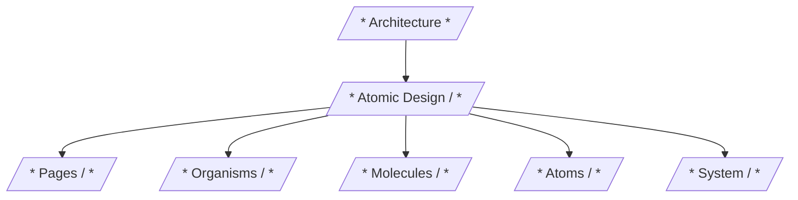

---

## I. PAGES (Top-Level Views)

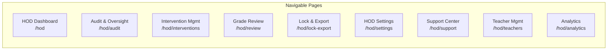

---

### 1. HOD Dashboard (`/hod`)

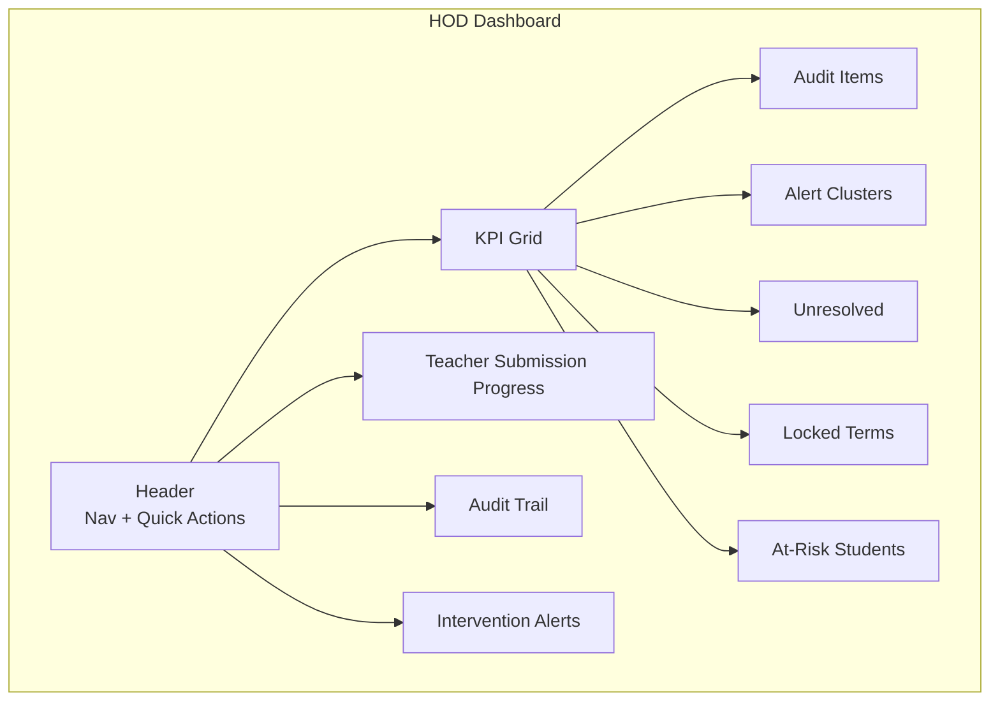

---

### 2. Audit & Oversight Center (`/hod/audit`)

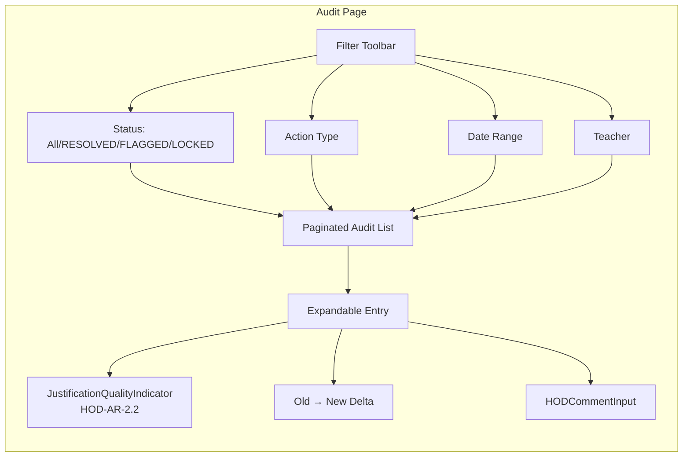

---

### 3. Intervention Management Hub (`/hod/interventions`)

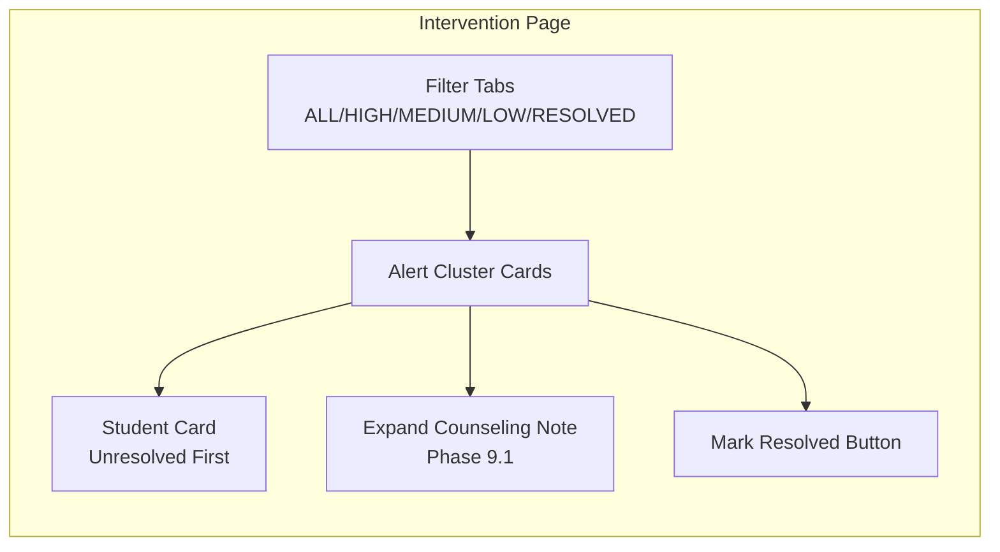

---

### 4. Grade Review & Approval (`/hod/review`)

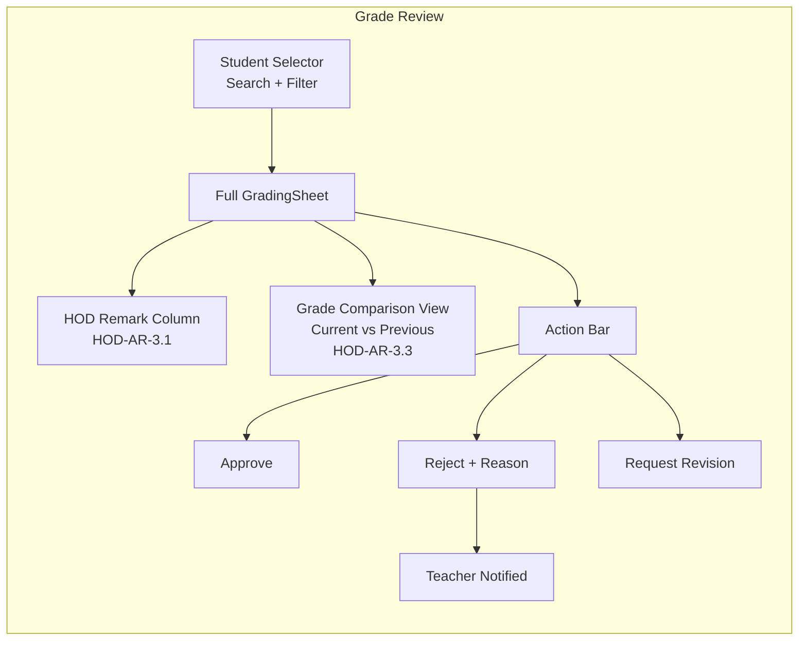

---

### 5. Final Lock & Export (`/hod/lock-export`)

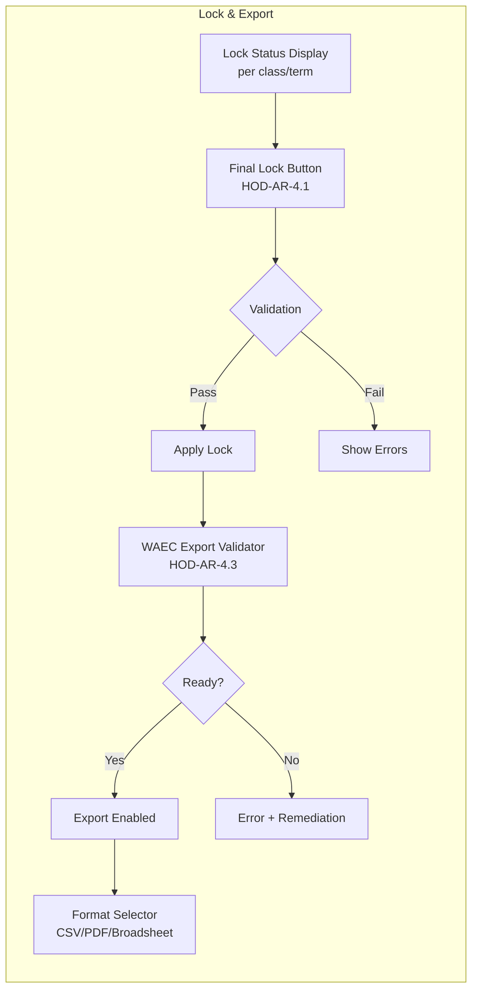

---

### 6. HOD Settings (`/hod/settings`)

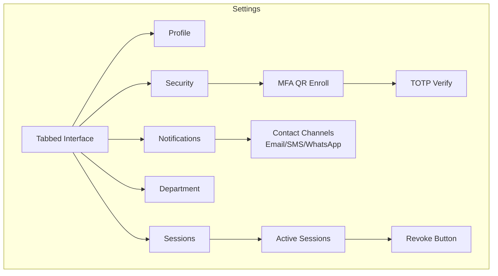

---

### 7. Support Center (`/hod/support`)

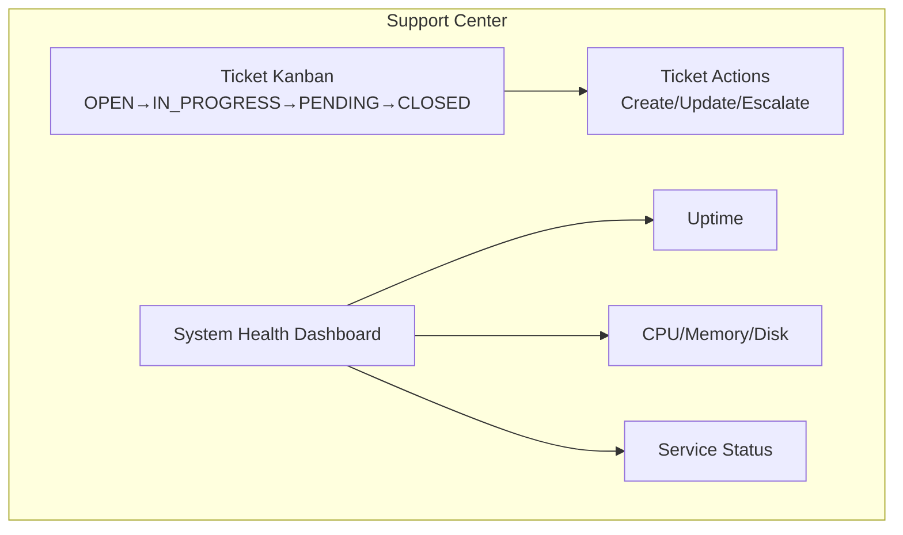

---

### 8. Teacher Management (`/hod/teachers`)

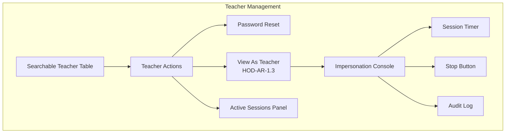

---

### 9. Analytics & Reporting (`/hod/analytics`)

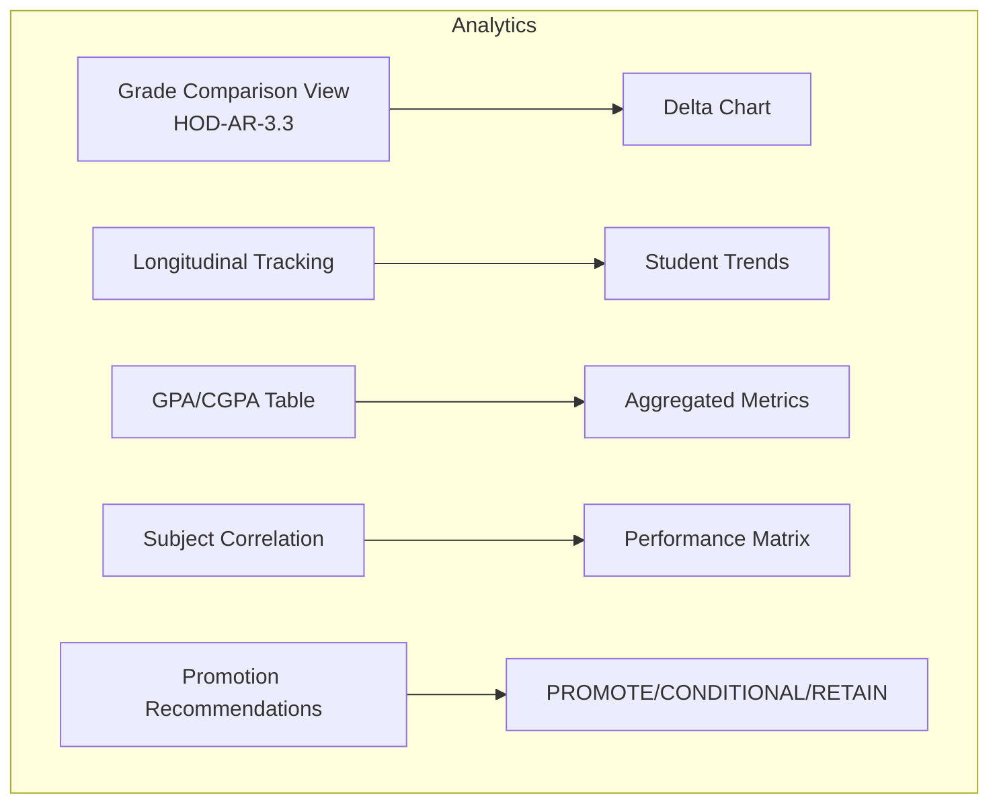

---

## II. ATOMIC DESIGN HIERARCHY DIAGRAM

```mermaid
flowchart BT
    subgraph Atoms[/* ATOMS */]
        direction TB
        A1[Typography]
        A2[Layout]
        A3[Forms]
        A4[Feedback]
        A5[Navigation]
        A6[Indicators]
        A7[Colors]
        A8[Spacing]
    end

    subgraph Molecules[/* MOLECULES */]
        direction TB
        M1[StatusBadge]
        M2[JustificationQualityIndicator]
        M3[SubmissionProgressSparkline]
        M4[AlertSeverityChip]
        M5[HODCommentInput]
        M6[DateRangeFilter]
        M7[MultiSelectSubjectFilter]
        M8[ExportFormatSelector]
        M9[ActionButtonGroup]
        M10[LoadingSpinner]
        M11[EmptyState]
        M12[ConfirmationDialog]
    end

    subgraph Organisms[/* ORGANISMS */]
        direction TB
        O1[AuditLogTimeline]
        O2[InterventionAlertCluster]
        O3[TeacherSubmissionMatrix]
        O4[GradeComparisonView]
        O5[WAECExportValidator]
        O6[HODCommentThread]
        O7[SupportTicketKanban]
        O8[TeacherImpersonationConsole]
        O9[SystemHealthMonitor]
    end

    subgraph Templates[/* TEMPLATES */]
        direction TB
        T1[Dashboard]
        T2[Table/List]
        T3[Form]
        T4[Detail View]
    end

    subgraph Pages_comp[/* PAGES */]
        direction TB
        P1[HOD Dashboard]
        P2[Audit]
        P3[Interventions]
        P4[Grade Review]
        P5[Lock & Export]
        P6[Settings]
        P7[Support]
        P8[Teachers]
        P9[Analytics]
    end

    Atoms --> Molecules
    Molecules --> Organisms
    Organisms --> Templates
    Templates --> Pages_comp
```

---

## III. ORGANISMS (Detailed)

### 1. AuditLogTimeline

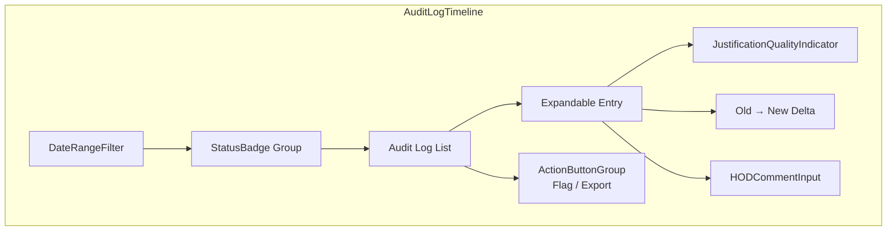

---

### 2. InterventionAlertCluster

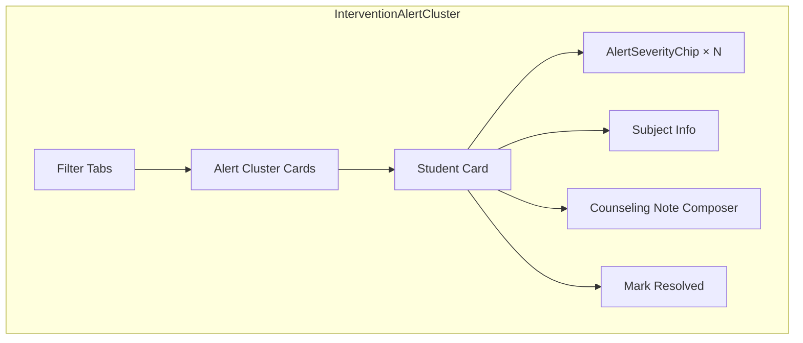

---

### 3. TeacherSubmissionMatrix

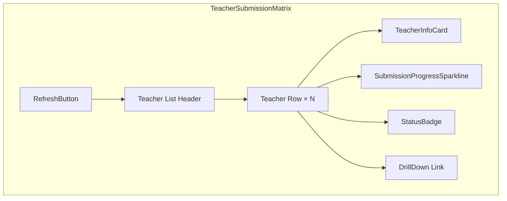

---

## IV. MOLECULES (Detailed)

### 1. StatusBadge

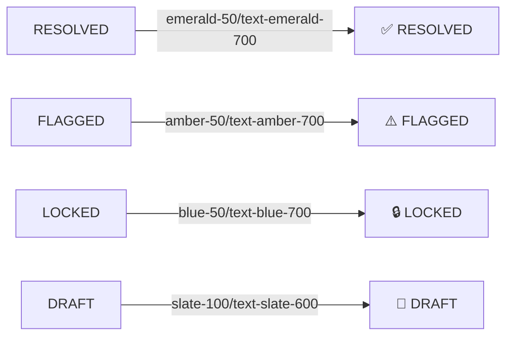

---

### 2. JustificationQualityIndicator

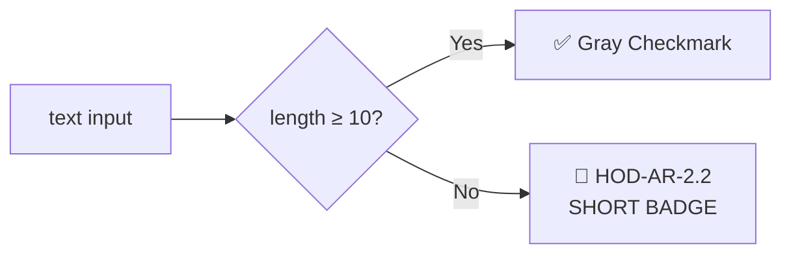

---

### 3. SubmissionProgressSparkline

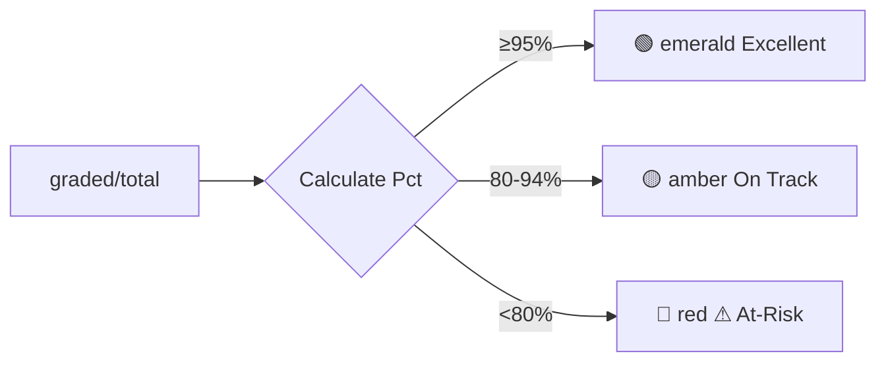

---

### 4. AlertSeverityChip

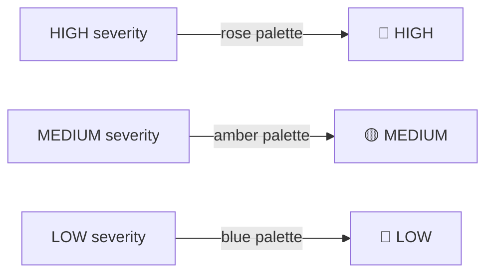

---

### 5. HODCommentInput

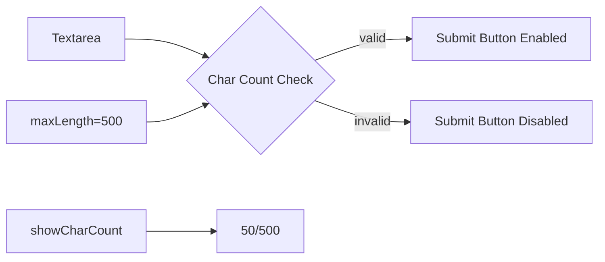

---

### 6. DateRangeFilter

```mermaid
graph LR
    direction LR
    A[Preset Buttons] --> B[Selected Preset]
    B --> B1[Today]
    B --> B2[Week]
    B --> B3[Month]
    B --> B4[Term]
    
    C[allowCustom=true] --> D[Custom Range Picker]
    D --> E[Start Date]
    D --> F[End Date]
```

---

## V. SYSTEM FLOW DIAGRAM

```mermaid
flowchart TD
    subgraph Client[Client Layer]
        A[HOD Dashboard<br/>React Components]
        B[Router<br/>/hod/*]
    end
    
    subgraph Auth[Auth Layer]
        C[AuthService]
        D[PermissionMiddleware]
        E[APIClient]
    end

    subgraph Cache[Cache Layer]
        F[DataSyncLayer]
        G[CacheLayer]
    end

    subgraph Services[Service Layer]
        H[AuditTrailService]
        I[NotificationService]
        J[ReportEngine]
        K[ErrorHandler]
        L[EventBus]
    end

    subgraph API[API Layer]
        M[REST API]
        N[Route Guards]
    end

    subgraph Database[Data Layer]
        O[(PostgreSQL)]
        P[Audit Logs]
        Q[Students]
        R[Teachers]
        S[Grades]
    end

    A --> B
    B --> C
    C --> D
    D --> E
    E --> F
    F --> G
    G --> H
    H --> I
    I --> J
    J --> K
    K --> L
    L --> M
    M --> N
    N --> O
    O --> P
    O --> Q
    O --> R
    O --> S
```

---

## VI. USER FLOW DIAGRAMS

### HOD Complete Workflow - Authentication to Action

```mermaid
flowchart TD
    A[HOD User] --> B[Login Page]
    B --> C{AuthService<br/>verifyHODRole()}
    C -->|Valid| D[HOD Dashboard]
    C -->|Invalid| E[Access Denied]
    
    D --> F{What Task?}
    
    F -->|Monitor Audit| G[Audit & Oversight]
    F -->|Review Student| H[Grade Review]
    F -->|Manage Interventions| I[Intervention Management]
    F -->|Final Lock/Export| J[Lock & Export]
    F -->|Settings| K[HOD Settings]
    F -->|Support| L[Support Center]
    F -->|Teachers| M[Teacher Management]
    
    G --> G1[Filter Audit Logs]
    G1 --> G2{Short Justification?}
    G2 -->|Yes| G3[Flag + Add HOD Comment]
    G2 -->|No| G4[Proceed]
    
    H --> H1[Select Student]
    H1 --> H2[Add HOD Remark<br/>HOD-AR-3.1]
    H2 --> H3{Approve or Reject?}
    H3 -->|Reject| H4[Notify Teacher with Reason<br/>HOD-AR-3.2]
    H3 -->|Approve| H5[Record Approved]
    
    I --> I1[View Interference Clusters<br/>HOD-AR-5.1]
    I1 --> I2[Add Counseling Note<br/>Phase 9.1]
    I2 --> I3{Needs Flag?}
    I3 -->|Yes| H4
    I3 -->|No| I4[Mark Resolved<br/>HOD-AR-5.2]
    
    J --> J1{All Classes Complete?}
    J1 -->|No| J2[Show Error]
    J1 -->|Yes| J3[Apply Final Lock<br/>HOD-AR-4.1]
    J3 --> J4[Generate WAEC Export<br/>HOD-AR-4.3]
    
    K --> K1[Update Settings]
    K1 --> K2[Save to Backend]
    
    L --> L1[View System Health]
    L --> L2{Add Ticket?}
    L2 -->|Yes| L3[Create Support Ticket]
    
    M --> M1[View Teachers]
    M --> M2[Impersonate Mode<br/>HOD-AR-1.3]
    M2 --> M3[Troubleshoot As Teacher]
```

---

### Grade Change Workflow (FR3 Justification)

```mermaid
flowchart TD
    A[HOD Opens GradingSheet<br/>in Correction Mode] --> B[Select Student]
    B --> C[Click Mark Field]
    C --> D[JustificationPopup Opens<br/>HOD-AR-2.1]
    
    D --> E[Display Original Mark]
    D --> F[Enter New Mark]
    D --> G[Enter Justification<br/>Required ≥10 chars]
    
    G --> H{Justification Valid?}
    H -->|No| I[Show Error: Too Short]
    I --> G
    H -->|Yes| J[Capture Edit<br/>Old Value → New Value]
    
    J --> K[AuditTrailService<br/>captureEdit()]
    K --> L[Save to Audit Log]
    L --> M[Update Grade Record]
    M --> N[HOD Adds Feedback Comment<br/>updateHODComment()]
    N --> O[Teacher Receives Notification]
    O --> P[Teacher Opens Correction Mode]
    P --> Q[HOD Feedback Visible<br/>in ObservationSidebar]
    
    Q --> R[Teacher Provides Explanation]
    R --> S[Teacher Submits to HOD]
    S --> T[HOD Reviews Response]
    T --> U{Decision}
    U -->|Approve| V[Record Archived]
    U -->|Reject| W[Return with Reason]
    W --> R
```

---

### Real-Time Data Sync Flow

```mermaid
flowchart TD
    subgraph Server[Backend]
        A[(Database)]
        B[WebSocket Server]
        C[Event Source]
    end

    subgraph Client[HOD Client]
        D[DataSyncLayer]
        E[HODContext<br/>useState hooks]
        F[UI Components]
    end

    A -->|Changes| C
    C -->|Events| B
    B -->|Push| D
    
    D -->|updateAuditLogs| E
    D -->|updateInterventionAlerts| E
    D -->|updateSubmissions| E
    
    E -->|rerender| F
    
    D -->|Fallback| G[Polling<br/>setInterval 30s]
    G -->|Refresh| D
```

---

## VII. ATOMS INTERACTION DIAGRAM (Form Propagation)

```mermaid
flowchart LR
    subgraph InputFlow[Form Input Flow]
        direction LR
        A[User Input] --> B[onChange Handler]
        B --> C[Validation Logic]
        C --> D[setFormState]
        D --> E[UI Rerenders]
        
        F[Validation Errors] --> G[Error Display]
        G --> H[User Sees Feedback]
    end

    subgraph ButtonFlow[Button Interaction Flow]
        direction LR
        I[Click] --> J{Disabled?}
        J -->|Yes| K[Ignore Click]
        J -->|No| L[Set Loading True]
        L --> M[Call API]
        M --> N{Success?}
        N -->|Yes| O[Set Loading False<br/>Close/Continue]
        N -->|No| P[Show Error Toast]
        P --> Q[Set Loading False]
    end
```

---

## VIII. DATA FLOW DIAGRAM (HOD Dashboard Page Load)

```mermaid
flowchart TD
    A[Page Load] --> B[AuthGuard<br/>RequireHOD]
    B -->|verified| C[useEffect]
    C --> D[refreshAll() called]
    
    D --> D1[refreshAuditLogs]
    D --> D2[refreshInterventionAlerts]
    D --> D3[refreshSubmissions]
    D --> D4[refreshLockedTerms]
    
    D1 --> E1[GET /api/hod/audit-logs]
    D2 --> E2[GET /api/hod/intervention-alerts]
    D3 --> E3[GET /api/hod/teachers/submissions]
    D4 --> E4[GET /api/hod/locked-terms]
    
    E1 --> F1[setAuditLogs]
    E2 --> F2[setInterventionAlerts]
    E3 --> F3[setTeacherSubmissions]
    E4 --> F4[setLockedTerms]
    
    F1 --> G[HODState in Context]
    F2 --> G
    F3 --> G
    F4 --> G
    
    G --> H[HODDashboard Component]
    H --> I[Render KPI Cards]
    H --> J[Render Audit Timeline]
    H --> K[Render Intervention Clusters]
```

---

## IX. ATOMIC DESIGN SIZE COMPARISON

```mermaid
graph LR
    A["<b>Atomic size</b><br/>(surface area)"] --> B{Complexity}
    
    B -->|Smallest| C[/* ATONS / */]
    B -->|Small| D[/* MOLECULES / */]
    B -->|Medium| E[/* Organisms / */]
    B -->|Large| F[/* Templates / */]
    B -->|Largest| G[/* PAGES / */]
    
    C --> C1[Button<br/>Input<br/>Label<br/>Icon]
    D --> D1[StatusBadge<br/>CommentInput<br/>Sparkline<br/>SeverityChip]
    E --> E1[AuditLogTimeline<br/>InterventionCluster<br/>SubmissionMatrix<br/>WAECValidator]
    F --> F1[Dashboard Layout<br/>Form Layout<br/>Table Layout<br/>Detail Layout]
    G --> G1[Full Page Views<br/>with Routing<br/>Data Fetching<br/>State Management]
```

---

## X. COMPONENT REUSABILITY MATRIX

```mermaid
graph TD
    subgraph Reuse[Component Reuse: Where Each Organism/Molecule Appears]
        direction TB
        
        O[Organism: AuditLogTimeline] -->|Primary| O1[Audit Center Page]
        O -->|Compact| O2[HOD Dashboard]
        
        M[Organism: InterventionAlertCluster] -->|Primary| M1[Interventions Hub]
        M -->|Compact| M2[HOD Dashboard]
        
        S[Organism: SupportTicketKanban] -->|Primary| S1[Support Center]
        
        T[Molecule: StatusBadge] -->|Reused| T1[AuditLogTimeline]
        T[Molecule: StatusBadge] -->|Reused| T2[InterventionAlertCluster]
        T[Molecule: StatusBadge] -->|Reused| T3[TeacherSubmissionMatrix]
        T[Molecule: StatusBadge] -->|Reused| T4[WAECExportValidator]
        
        J[Molecule: JustificationQualityIndicator] -->|Reused| J1[AuditLogTimeline]
        J[Molecule: JustificationQualityIndicator] -->|Reused| J2[WAECExportValidator]
        
        B[Molecule: ActionButtonGroup] -->|Reused| B1[HODCommentThread]
        B[Molecule: ActionButtonGroup] -->|Reused| B2[TeacherImpersonationConsole]
        B[Molecule: ActionButtonGroup] -->|Reused| B3[WAECExportValidator]
    end
```

---

## XI. IMPLEMENTATION PRIORITIES (Visual)

```mermaid
gantt
    title MAAIS HOD View Rebuild - Implementation Timeline
    dateFormat  YYYY-MM-DD
    section Phase 1: Foundation (Critical)
    AuthService + PermissionMiddleware       :2025-01-01, 7d
    APIClient + CacheLayer                   :2025-01-08, 5d
    Core Atoms (Typography + Layout)         :2025-01-13, 7d
    HOD Dashboard skeleton (real data)       :2025-01-20, 10d
    
    section Phase 2: Core Features (High)
    Audit & Oversight Center (HOD-AR-2.x)    :2025-02-01, 14d
    Grade Review & Approval (HOD-AR-3.x)     :2025-02-15, 14d
    Intervention Management (HOD-AR-5.x)      :2025-02-15, 10d
    
    section Phase 3: Completion (Medium)
    Final Lock & Export (HOD-AR-4.x)         :2025-03-01, 14d
    Teacher Management (HOD-AR-1.x)           :2025-03-01, 10d
    Analytics & Reporting (HOD-AR-3.3)        :2025-03-11, 10d
    
    section Phase 4: Polish (Low)
    Skeleton loading states                   :2025-03-21, 7d
    Advanced filtering + search              :2025-03-21, 7d
    Performance optimizations                :2025-03-28, 7d
    Accessibility audit                      :2025-04-04, 7d
```

---

## XII. REQUIRED DATA STRUCTURE FOR CROSS-SUBJECT VISIBILITY

```mermaid
erDiagram
    STUDENT {
        string studentId PK
        string name
        string indexNumber
        string programme
        string form
        string className
        number overallAverage
        string waecReadiness
    }

    SUBJECT_ENROLLMENT {
        string enrollmentId PK
        string studentId FK
        string subjectId FK
        string subjectName
        string department
        string type "CORE|ELECTIVE|CROSS_DEPT"
        string teacherId FK
        string teacherName
        number|null currentMark
        number|null previousMark
        string grade
        string auditStatus
        datetime lastUpdated
    }

    AUDIT_LOG {
        string logId PK
        string recordId FK
        string recordType "grade|hod_comment"
        string userId
        string action
        string justification
        json oldValue
        json newValue
        string status
        datetime timestamp
    }

    HOD_COMMENT {
        string commentId PK
        string recordId FK
        string hodId FK
        string hodName
        text message
        datetime createdAt
    }

    STUDENT ||--o{ SUBJECT_ENROLLMENT : "enrolled in"
    SUBJECT_ENROLLMENT ||--o{ AUDIT_LOG : "has audit"
    AUDIT_LOG ||--o{ HOD_COMMENT : "may have"
```

---

*This atomic design system document provides a complete foundation for rebuilding the HOD view with proper separation of concerns, reusability, and scalability while addressing all documented requirements and identified gaps.*
