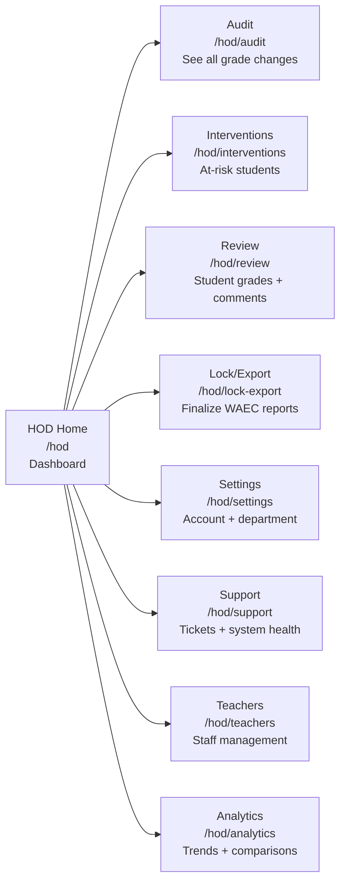

# MAAIS HOD View - Simplified Atomic Design Structure

## Visual Hierarchy (Mermaid)

```mermaid
graph TD
    A[HOD VIEW REBUILD] --> B[Pages<br/>9 Complete Screens]
    A --> C[Organisms<br/>9 Complex Components]
    A --> D[Molecules<br/>12 Reusable Components]
    A --> E[Atoms<br/>8 Basic Elements]
    A --> F[System<br/>10 Services]
    
    B --> B1[Dashboard]
    B --> B2[Audit]
    B --> B3[Interventions]
    B --> B4[Review]
    B --> B5[Lock/Export]
    B --> B6[Settings]
    B --> B7[Support]
    B --> B8[Teachers]
    B --> B9[Analytics]
    
    C --> C1[AuditLogTimeline]
    C --> C2[InterventionClusters]
    C --> C3[SubmissionMatrix]
    C --> C4[GradeComparison]
    C --> C5[ExportValidator]
    C --> C6[CommentThread]
    C --> C7[TicketKanban]
    C --> C8[ImpersonationConsole]
    C --> C9[SystemHealth]
    
    D --> D1[StatusBadge]
    D --> D2[JustificationIndicator]
    D --> D3[ProgressSparkline]
    D --> D4[SeverityChip]
    D --> D5[HODCommentInput]
    D --> D6[DateFilter]
    D --> D7[SubjectFilter]
    D --> D8[FormatSelector]
    D --> D9[ActionButtons]
    D --> D10[LoadingSpinner]
    D --> D11[EmptyState]
    D --> D12[ConfirmDialog]
    
    E --> E1[Typography]
    E --> E2[Layout]
    E --> E3[Forms]
    E --> E4[Feedback]
    E --> E5[Navigation]
    E --> E6[Icons/Colors]
    
    F --> F1[Auth]
    F --> F2[DataSync]
    F --> F3[AuditTrail]
    F --> F4[Notifications]
    F --> F5[Reports]
    F --> F6[Permissions]
    F --> F7[Cache]
    F --> F8[ErrorHandler]
    F --> F9[APIClient]
    F --> F10[EventBus]
```



---

## 1. PAGES (9 Screens)

These are the main screens the HOD user will navigate to. Each is a complete page with URL route.



### What each page does:

| Page | Purpose | Key Actions |
|------|---------|-------------|
| **Dashboard** | Overview of everything | View KPIs, scan audit logs, see alerts |
| **Audit** | Track all grade changes | Filter logs, flag bad justifications, add comments |
| **Interventions** | Student performance alerts | Add counseling notes, mark resolved |
| **Review** | Individual student grades | Add HOD remarks, reject/approve revisions |
| **Lock/Export** | Finalize grades | Lock classes, generate WAEC CSV/PDF |
| **Setting** | Configuration | MFA setup, notifications, sessions |
| **Support** | Help desk | Create tickets, monitor system health |
| **Teachers** | Staff admin | Reset passwords, impersonate for troubleshooting |
| **Analytics** | Reports | Grade trends, subject correlations, promotions |

---

## 2. ORGANISMS (9 Major Components)

These are big, complex sections made of many molecules working together. Like a fully functional widget.

```
AuditLogTimeline
├── DateRangeFilter
├── StatusBadge (many)
├── JustificationIndicator
├── Old → New Delta display
├── HODCommentInput
└── ActionButtons

InterventionAlertCluster
├── FilterTabs
├── StudentCard
├── SeverityChip
├── CounselingNoteComposer
└── ResolveButton

TeacherSubmissionMatrix
├── TeacherInfoCard
├── ProgressSparkline
├── StatusBadge
└── RefreshButton

WAECExportValidator
├── ValidationChecklist
├── ErrorList
├── ProgressIndicator
└── ExportButton

HODCommentThread
├── CommentBubble×N
├── TimeStamp×N
├── Avatar×2
└── ReplyInput
```

---

## 3. MOLECULES (12 Reusable Components)

These are small, focused components. Think of them as building blocks. One job, used everywhere.

| Molecule | What It Does | Where It's Used |
|----------|--------------|-----------------|
| **StatusBadge** | Shows RESOLVED/FLAGGED/LOCKED/DRAFT with colors | Audit, Interventions, Submissions |
| **JustificationIndicator** | Red warning if justification < 10 chars (AR-2.2 rule) | Audit logs, exports |
| **ProgressSparkline** | Mini progress bar (green/amber/red by threshold) | Dashboard, submission matrix |
| **SeverityChip** | HIGH/MEDIUM/LOW colored tag | Interventions, alerts |
| **HODCommentInput** | Textarea + submit button + character counter | Grade review, audit logs |
| **DateRangeFilter** | Pick dates with preset buttons (Today/Week/Month/Term) | Audit page, reports |
| **SubjectFilter** | Checkbox list of subjects to filter by | Audit, analytics, review |
| **ExportFormatSelector** | Pick export type (CSV/PDF/Broadsheet) | Lock/Export page |
| **ActionButtons** | Group of buttons (Approve/Reject/Flag/Export) | Everywhere actions happen |
| **LoadingSpinner** | Spinning loader with optional label | Any loading state |
| **EmptyState** | Consistent "nothing here" display | Empty audit logs, no alerts |
| **ConfirmDialog** | "Are you sure?" popup with Yes/No | Lock button, reject, delete |

---

## 4. ATOMS (8 Basic Elements)

The smallest, most basic pieces. No logic, just display.

```
TEXT
━━━━━━━━━━━━━━━━━━━━━━━━━━━
H1  → Big heading   (2xl/3xl, font-black)
H2  → Section       (xl/2xl, font-bold)
H3  → Subsection    (lg/xl)
Body→ Regular text  (sm/base, font-medium)
Label→ Field label  (xs, font-bold, uppercase)
Caption→ Small text (9/10px, gray)
Tiny → Tiny text    (8/9px, uppercase, tracking-wider)

LAYOUT
━━━━━━━━━━━━━━━━━━━━━━━━━━━
Container  → Max-width wrapper (1280px max)
Grid       → Responsive columns (1/2/3/4/6/12)
Flex       → Horizontal layout with gap
Stack      → Vertical layout with gap
Divider    → Horizontal or vertical line
Spacer     → Empty space (0-96px in steps)

FORMS
━━━━━━━━━━━━━━━━━━━━━━━━━━━
Input      → text/email/password/number
Textarea   → Multi-line text
Select     → Dropdown
Checkbox   → Single check
Toggle     → On/Off switch

FEEDBACK
━━━━━━━━━━━━━━━━━━━━━━━━━━━
Toast      → Success/Error/Warning/Info banner (auto-hide)
Tooltip    → Hover hint
Badge      → Number badge (e.g. unread count)
ProgressBar→ Linear fill indicator
Alert      → colored message box

NAVIGATION & ICONS
━━━━━━━━━━━━━━━━━━━━━━━━━━━
Button     → Primary/Secondary/Danger/Ghost
Link       → Text hyperlink
Icon       → Lucide icons (AlertTriangle, CheckCircle, etc.)
Avatar     → User picture
StatusDot  → Online/Offline/Busy/Away

COLORS
━━━━━━━━━━━━━━━━━━━━━━━━━━━
Primary:   Emerald   #015D34 / #10B981
Success:   Emerald   #059669
Warning:   Amber     #D97706
Error:     Rose      #DC2626
Info:      Blue      #3B82F6
Neutral:   Slate/Gray
```

---

## 5. SYSTEM COMPONENTS (10 Services)

These run in the background - NOT UI. They handle data, auth, logging, etc.

| Service | What It Does |
|---------|-------------|
| **AuthService** | Check if user is HOD, manage login session, verify permissions |
| **PermissionMiddleware** | Protect routes: only HOD can enter /hod/* pages |
| **APIClient** | Send HTTP requests with auth token baked in |
| **CacheLayer** | Save data locally so pages load faster |
| **DataSyncLayer** | Auto-update dashboard when something changes (WebSocket or polling) |
| **AuditTrailService** | Save old value + new value + justification to audit log |
| **NotificationService** | Send alerts to teachers when HOD adds comments |
| **ReportEngine** | Build WAEC-compliant CSV/PDF/broadsheet files |
| **ErrorHandler** | Catch errors, show user-friendly messages, retry failed requests |
| **EventBus** | Publish/subscribe events. "Comment added" → update sidebar → send notification |

---

## 6. HOW IT FITS TOGETHER (The Big Picture)

```mermaid
flowchart TD
    A[HOD User Opens Dashboard] --> B[AuthGuard checks role]
    B -->|HOD OK| C[Page loads]
    
    C --> D[DataSyncLayer pulls fresh data]
    D --> E[8 API calls happen at once]
    E --> F[Cache saves data]
    F --> G[UI renders]
    
    G --> H[HOD clicks Audit tab]
    H --> I[AuditLogTimeline organism renders]
    I --> J[Uses molecules: StatusBadge, JustificationIndicator, DateRangeFilter, ActionButtons]
    J --> K[Each molecule is made of atoms: Text, Icons, Spacing, Colors]
    
    L[HOD clicks "Add Comment"] --> M[HODCommentInput molecule]
    M --> N[Textarea atom + Button atom + Label atom]
    N --> O[Submit → AuditTrailService]
    O --> P[Save to database]
    P --> Q[EventBus fires "COMMENT_ADDED"]
    Q --> R[NotificationService emails teacher]
    Q --> S[Teacher sees comment in their sidebar]
```

---

## 7. SIMPLE EXAMPLES

### Example 1: HOD Dashboard loading

```
1. User visits /hod
2. AuthGuard → "Is HOD?" → Yes
3. Dashboard page loads
4. HODContext calls refreshAll()
5. 8 API calls fire in parallel:
   GET /audit-logs
   GET /intervention-alerts
   GET /teachers/submissions
   GET /locked-terms
   ...etc
6. Context state updates
7. Dashboard re-renders with real data
8. User sees: KPIs, AuditFeed, Alerts, SubmissionMatrix
```

### Example 2: HOD adds feedback to a student

```
1. HOD goes to Review page
2. Selects student Angela Owusu
3. Clicks mark field → edits it
4. FR3 justification popup appears
5. Enters new mark + justification (≥10 chars)
6. Clicks Save
7. → Backend saves old→new value + justification
8. → AuditLogTimeline organism shows new entry
9. → HOD adds remark in HODCommentInput
10.→ submit → POST /api/hod/records/:id/comment
11.→ NotificationService sends email to teacher
12.→ Teacher opens GradingSheet → sees HOD feedback in sidebar
```

### Example 3: HOD exports WAEC CSV

```
1. HOD goes to Lock/Export page
2. Selects class: SHS1 Agric B
3. WAECExportValidator checks:
   ✅ All marks entered (100%)
   ✅ No missing observations
   ✅ All justifications ≥10 chars
   ✅ Term is locked
4. Validation → all pass → Export button enabled
5. HOD clicks Export → FormatSelector opens
6. Selects CSV
7. ReportEngine calls WAEC CSV API
8. File downloads
```

---

## 8. REUSE MAP (What Uses What)

```
AUDIT PAGE uses:
├── HODDashboard (organism) on Dashboard
├── AuditLogTimeline (organism) on Audit page
└── Molecules: StatusBadge, JustificationIndicator,
    DateRangeFilter, ActionButtons, EmptyState

INTERVENTIONS PAGE uses:
├── InterventionAlertCluster (organism) on Intervention page
├── InterventionAlertCluster (compact) on Dashboard
└── Molecules: SeverityChip, ConfirmationDialog, EmptyState

GRADE REVIEW uses:
├── HODCommentThread (organism)
├── GradeComparison (organism)
└── Molecules: HODCommentInput, ActionButtons, SubjectFilter

LOCK/EXPORT uses:
├── WAECExportValidator (organism)
└── Molecules: FormatSelector, ActionButtons,
    LoadingSpinner, ConfirmDialog, EmptyState

SUPPORT uses:
├── SupportTicketKanban (organism)
└── Molecules: SeverityChip, EmptyState, ActionButtons

TEACHERS uses:
└── TeacherImpersonationConsole (organism)

SETTINGS uses:
└── ConfirmationDialog, LoadingSpinner, EmptyState

ALL PAGES use:
├── Atoms: Typography, Layout, Forms, Colors, Spacing, Icons
├── Molecules: LoadingSpinner, EmptyState, ConfirmDialog
└── Services: Auth, APIClient, ErrorHandler, NotificationService
```

---

## 9. QUICK REFERENCE: FILE STRUCTURE

```
src/
├── components/
│   ├── atoms/          ← 8 groups (Typography, Button, Input, etc.)
│   ├── molecules/      ← 12 components
│   ├── organisms/      ← 9 components
│   ├── templates/      ← 4 layouts
│   └── shared/
│       ├── CorrectionMode.jsx   ← Existing
│       └── ObservationSidebar.jsx ← Existing
├── pages/hod/
│   ├── HODDashboard.jsx         ← Existing → will be rebuilt
│   ├── HODAudit.jsx             ← New
│   ├── HODInterventions.jsx     ← New
│   ├── HODReview.jsx            ← New
│   ├── HODLockExport.jsx        ← New
│   ├── HODSettings.jsx          ← Existing → enhance
│   ├── HODSupport.jsx           ← Existing → enhance
│   ├── HODTeachers.jsx          ← New
│   └── HODAnalytics.jsx         ← New
├── services/
│   └── hodService.js            ← Existing → extend
├── context/
│   └── HODContext.jsx           ← Existing → extend
└── system/
    ├── AuthService.ts           ← New
    ├── DataSyncLayer.ts         ← New
    ├── AuditTrailService.ts     ← New
    ├── NotificationService.ts   ← New
    ├── ReportEngine.ts          ← New
    ├── PermissionMiddleware.ts  ← New
    ├── CacheLayer.ts            ← New
    ├── ErrorHandler.ts          ← New
    ├── APIClient.ts             ← New
    └── EventBus.ts              ← New
```

---

## 10. THE "AHA" MOMENT

```
┌─────────────────────────────────────────┐
│       HOD is a single page app          │
│   built in atomic layers               │
│                                         │
│  LAYER 9  Layered UI    ORGANISMS     │
│         (Organisms)                     │
│  ┌────────────┐  ┌────────────────┐  │
│  │Timeline    │  │Cluster         │  │
│  │Matrix      │  │Thread          │  │
│  │Validator   │  │Kanban          │  │
│  └────────────┘  └────────────────┘  │
│         (Molecules)                     │
│  ┌────┐┌────┐┌────┐┌────┐┌────┐    │
│  │Badge││Input││Btn ││Chip││Filter│   │
│  └────┘└────┘└────┘└────┘└────┘    │
│       (Atoms)                           │
│  ┌───┐┌───┐┌───┐┌───┐┌───┐        │
│  │Text││Icon││Btn ││Input││Box │       │
│  └───┘└───┘└───┘└───┘└───┘        │
│        (System - invisible plumbing)   │
│  Auth,API,Cache,Events,Errors          │
└─────────────────────────────────────────┘
```

**The bottom line:**
- **Pages** = What users click through (9 screens)
- **Organisms** = Big sections you see on those screens (9 components)
- **Molecules** = Small reusable tools used everywhere (12 components)
- **Atoms** = The smallest pieces: text, colors, spacing (8 groups)
- **System** = plumbin g: auth, API, cache, logging (10 services)

Build bottom-up: Atoms → Molecules → Organisms → Templates → Pages.
