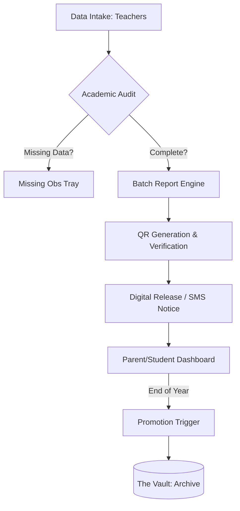

# MAAIS - Academic Audit & Intervention System

## Mando Senior High Technical School (Mando SHTS)

MAAIS is a high-fidelity academic management ecosystem designed to automate and secure the academic lifecycle of Mando SHTS. It transitions the school from fragmented data silos to a unified, audit-ready platform for student performance tracking, official reporting, and stakeholder communication.

---

## 🛠 Core Modules

### 1. Academic Architect (Structure)
The engine room where the school's identity and academic rules are defined.
- **Academic Years & Terms**: Management of active and past session boundaries.
- **Course Mapping**: Configuration of Core and Elective subjects.
- **Grading Rules**: Customization of boundaries (A1-F9) and "Smart Remarks" logic.

### 2. Comms & Reports (The Megaphone)
A centralized hub for internal and external information dissemination.
- **Batch Report Generator**: High-speed compilation of terminal report cards with QR-code authenticity.
- **Transcript Builder**: One-click generation of 3-year historical transcripts for alumni and university applications (PDF/Print).
- **Multi-Channel Comms**: Emergency SMS failover and real-time App notifications with delivery receipts.
- **Analytics Pulse**: Visualization of academic strength, enrollment trends, and attendance patterns.

### 3. Archive Management (The Vault)
Maintains historical integrity and handles yearly transitions.
- **Promotion Cycle**: Automated "Promote" (F1→F2), "Graduate" (F3→Alumni), and "Cleanse" (System Reset) triggers.
- **The Vault**: Searchable historical database for GES audits and transcript retrieval.
- **Maintenance**: Database health checks and hash verification for data integrity.

### 4. Grading & Assessment (Precision)
Real-time grade entry with automated intelligence.
- **Smart Remarks**: AI-assisted suggestion pool based on grade categories (e.g., C5 triggers "Can do better with more effort").
- **Audit Trails**: Tracking of grade corrections and missing observations.

---

## 🔄 System Flow (Technical Journey)

1.  **Ingestion**: Grade entries are submitted via Terminal Sheets.
2.  **Audit Phase**: The system scans for "Missing Observations" (e.g., student has score but no attendance).
3.  **Compiling**: The Report & Transcript engines pull weighted averages from across the 3-year history.
4.  **Verification**: Every printed/PDF document is assigned a unique system hash and QR code.
5.  **Archival**: At the end of Term 3, the Promotion Logic moves records out of active tables into the high-performance Vault.

---

## 👥 User Flow (Persona Experience)

### **For Administrators (Admissions & Headmaster)**
- **Morning**: Review the "Academic Pulse" dashboard for attendance or performance anomalies.
- **Reporting**: Trigger batch generation of 1,000+ report cards at the end of the term.
- **Transcripts**: Handle university requests by searching "The Vault" and exporting PDFs for alumni.
- **Safety**: Execute the "Promotion Cycle" to reset the school for a new intake.

### **For Teachers & HODs**
- **Input**: Enter scores directly into the Grading Sheets.
- **Correction**: Access the "Academic Audit" to see which grades were flagged for review.
- **Approval**: HODs verify and "lock" sheets to prevent further editing before report release.

### **For Students & Parents**
- **Visibility**: Access the "Journey" view to see historical performance trends.
- **Notifications**: Receive instant SMS alerts for emergency notices or result readiness.

---

## 🚀 Tech Stack
- **Frontend**: React 18 + Vite (TypeScript)
- **Styling**: Tailwind CSS + Custom Design System
- **Animation**: Framer Motion
- **Visuals**: Lucide React + Recharts
- **Export**: html2canvas + jsPDF
