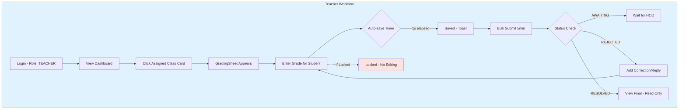

# Teacher User Flow

## Overview
Detailed workflow for Teacher users in the MAAIS Academic Audit System.

---

## Teacher Grading Flow

### Entry Point: Dashboard
```
TeacherDashboard.jsx
  → Click Class Card (from assigned subjects)
  → GradingSheet appears for that class
```

### Auto-save Behavior
1. Teacher enters grade for a student in the sheet
2. **Per-student auto-save:** Entry saves automatically after 1 second
3. **UI Feedback:** Toast notification confirms "Saved" for each individual entry
4. **Draft Persistence:** Each entry stored as draft locally before server sync

**Frontend Handler:** `teacherService.bulkUpsertGradeEntries()` → `POST /grading/entries/bulk`

### Draft Management
- All entries saved as drafts to localStorage via `HODContext.jsx:saveDraftRecord()`
- Drafts persist through offline mode (`isEffectivelyOffline` state)
- Every 5 minutes: Bulk submit all drafts to server
- **UI Feedback:** Toast confirms "Bulk draft submitted" on 5-min interval

---

## Grade Revision Request Flow

### Step 1: Identify Issue
- Teacher notices grade discrepancy in sheet
- Or notices missing observation (`TeacherMissingObservations.jsx`)

### Step 2: Submit Revision
```jsx
TeacherGradingView.jsx or TeacherRevisionsFeed.jsx
  → teacherService.submitGradeRevision(revisionData)
    → POST /teacher/grade-revisions
      → teacher.service.ts:422-479 submitGradeRevision()
```

**Backend Creates:**
- `GradeRevision` record with `status: 'AWAITING_APPROVAL'`
- Notification sent to HOD

### Step 3: View My Revisions
```jsx
TeacherRevisionsFeed.jsx:useEffect
  → teacherService.getGradeRevisions()
    → GET /teacher/grade-revisions
      → teacher.service.ts:380-420 getGradeRevisions()
```

**Status Display:**
| Status | UI Badge | Action Available |
|--------|----------|-----------------|
| `AWAITING_APPROVAL` | Amber "Awaiting HOD" | Reply, edit |
| `TEACHER_REPLIED` | Sky "HOD Reviewing" | Wait only |
| `RESOLVED` | Emerald "Resolved" | Read-only |
| `REJECTED` | Red "Rejected" | Resubmit |

---

## Teacher Response Flow

### Responding to HOD Feedback
```jsx
TeacherRevisionsFeed.jsx:appendTeacherResponse()
  → teacherService.updateGradeRevision(revisionId, updatedData)
    → PATCH /teacher/grade-revisions/{id}
      → teacher.service.ts:535-581 updateGradeRevision()
```

**Response Types:**
1. **Discussion message:** Real-time thread via `sendDiscussionMessage()`
2. **Formal response:** Updates status to `TEACHER_REPLIED`
3. **Correction submission:** Attach corrected grades/evidence

**Notification to HOD:**
- `notification.notifyHODOfTeacherAction()` triggers in-app notification

---

## Lock State Impact

### When HOD Locks Term/Class
- **Before lock:** Interactive grade sheet with save/autosave
- **After lock:** Grade sheet becomes non-interactive (read-only)
- **UI State:** All inputs disabled, "Locked" badge shows

### Lock Check (`grading.service.ts:182-188`)
```typescript
if (term.isLocked) {
  throw new ForbiddenException('Term is locked. Grades cannot be modified.');
}
```

---

## Teacher Flowchart

