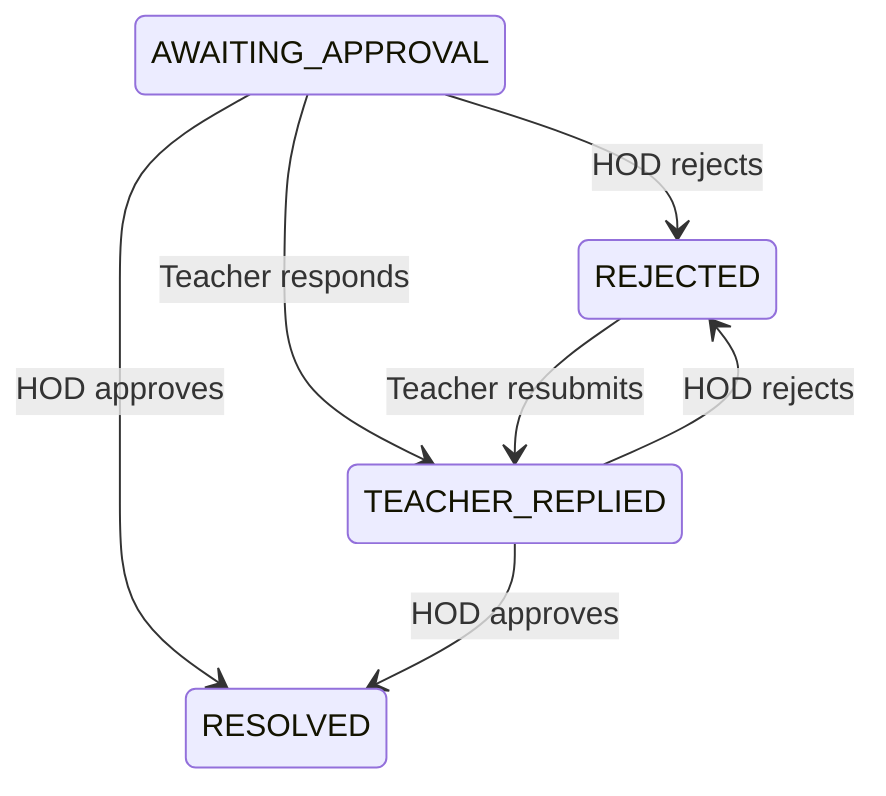
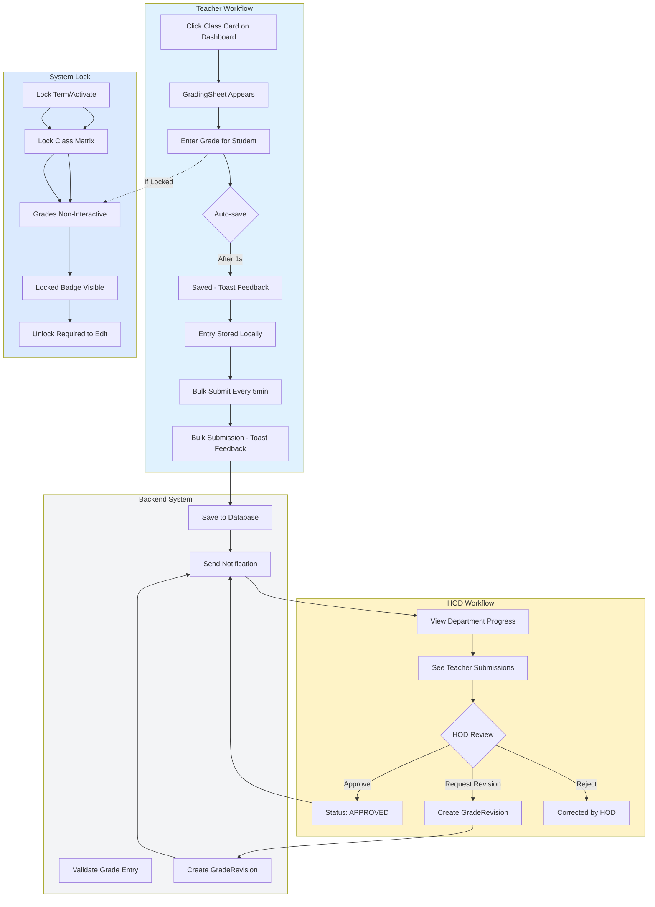
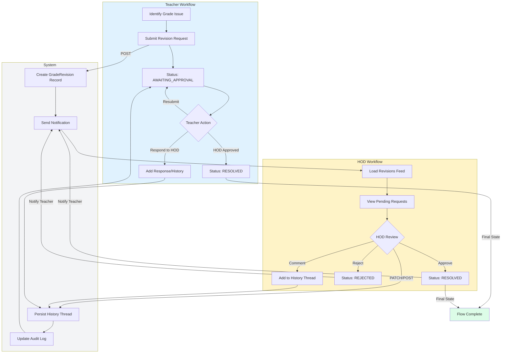

# Teacher ↔ HOD User Flow

## Overview

This document describes the complete workflow for grade revision requests between Teachers and Heads of Department (HOD) in the MAAIS Academic Audit System.

---

## Teacher → HOD Flow

### 1. Teacher Initiates Grade Revision

**Entry Point:** Teacher identifies an issue with a grade entry
- Access via `TeacherGradingView.jsx` or `TeacherMissingObservations.jsx`
- Teacher submits revision request through UI

**API Call Chain:**
```
TeacherRevisionsFeed.jsx
  → teacherService.submitGradeRevision()
    → POST /teacher/grade-revisions
      → teacher.service.ts:422-479 submitGradeRevision()
```

**Backend Process (`teacher.service.ts:422-479`):**
1. Validates grade entry exists
2. Creates `GradeRevision` record in database with:
   - `status: 'AWAITING_APPROVAL'`
   - `history: []` (empty array for discussion thread)
   - Links to student, subject, and original grade entry
3. Sends notification to HOD via `notifyStaff()` → creates `notification` record

**Notification Flow:**
- If teacher submits: Notifies HOD(s) in same department
- If HOD submits on behalf of teacher: Notifies the teacher directly

---

### 2. HOD Reviews Revision

**Entry Point:** HOD accesses revision feed
- `HODRevisionsFeed.jsx` loads on `/hod/revisions` route

**API Call Chain:**
```
HODRevisionsFeed.jsx
  → hodService.getGradeRevisions()
    → GET /hod/grade-revisions
      → hod-grades.service.ts:13-83 getGradeRevisions()
```

**HOD View:**
- Sees revisions in "Needs Approval" tab
- Status displayed as `AWAITING_APPROVAL`
- Can view: student name, class, subject, issue description, severity
- Can see discussion history (empty initially)

**Actions Available to HOD:**
- Add comment: `PATCH /hod/records/{id}/comment`
- Approve: `POST /hod/records/{id}/approve`
- Reject: `POST /hod/records/{id}/reject`
- Send discussion message (real-time thread)

---

### 3. HOD Makes Decision

#### Approve Flow
```
HODRevisionsFeed.jsx:handleApprove()
  → hodService.updateHODComment()
    → PATCH /hod/records/{id}/comment
  → hodService.approveGradeRevision()
    → POST /hod/records/{id}/approve
      → hod-grades.service.ts:85-127 approveGradeRevision()
```

**Backend Process (`hod-grades.service.ts:85-127`):**
1. Validates HOD role permissions
2. Updates revision history with HOD comment
3. Sets `status: 'RESOLVED'`
4. Sends notification to teacher via `notifyTeacher()`

#### Reject Flow
```
HODRevisionsFeed.jsx:handleReject()
  → hodService.rejectGradeRevision()
    → POST /hod/records/{id}/reject
      → hod-grades.service.ts:129-171 rejectGradeRevision()
```

**Backend Process:**
1. Validates HOD role permissions
2. Updates revision history with rejection reason
3. Sets `status: 'REJECTED'`
4. Sends notification to teacher

---

## HOD → Teacher Flow (Response/Back)

### 4. Teacher Receives HOD Decision

**Teacher View (`TeacherRevisionsFeed.jsx`):**
- Revision list refreshes via `teacherService.getGradeRevisions()`
- Status-based UI changes:

| Status | Teacher UI Display | Action State |
|--------|-------------------|--------------|
| `AWAITING_APPROVAL` | "Awaiting HOD" (amber badge) | Can reply/respond |
| `TEACHER_REPLIED` | "HOD Reviewing" (sky badge) | Waiting for final decision |
| `RESOLVED` | "Resolved" (emerald badge) | Flow complete, read-only |
| `REJECTED` | "Rejected" (red badge) | Can respond with corrections |

---

### 5. Teacher Responds to HOD (If Rejected or HOD Comments)

**API Call:**
```
TeacherRevisionsFeed.jsx:sendDiscussionMessage() or appendTeacherResponse()
  → teacherService.updateGradeRevision()
    → PATCH /teacher/grade-revisions/{id}
      → teacher.service.ts:535-581 updateGradeRevision()
```

**Teacher Response Types:**
1. **Discussion message:** Real-time thread communication
2. **Formal response:** Sets status to `TEACHER_REPLIED` with additional context
3. **Correction submission:** Attach evidence or corrected grades

**Notification Back to HOD:**
- `notification.notifyHODOfTeacherAction()` triggers in-app notification
- HOD sees updated in revisions feed

---

## Key API Endpoints

### Teacher Endpoints
| Endpoint | Method | Handler | Description |
|----------|--------|---------|-------------|
| `/teacher/grade-revisions` | POST | `teacher.service.ts:422-479` | Submit revision request |
| `/teacher/grade-revisions` | GET | `teacher.service.ts:380-420` | Get teacher's revisions |
| `/teacher/grade-revisions/{id}` | PATCH | `teacher.service.ts:535-581` | Update revision with response |
| `/teacher/observations` | POST | `grading.service.ts:789-824` | Create grade observation |
| `/teacher/observations/{id}` | PATCH | `grading.service.ts:826-884` | Update observation |

### HOD Endpoints
| Endpoint | Method | Handler | Description |
|----------|--------|---------|-------------|
| `/hod/grade-revisions` | GET | `hod-grades.service.ts:13-83` | Get department revisions |
| `/hod/records/{id}/approve` | POST | `hod-grades.service.ts:85-127` | Approve revision |
| `/hod/records/{id}/reject` | POST | `hod-grades.service.ts:129-171` | Reject revision |
| `/hod/records/{id}/comment` | PATCH | `hod-grades.service.ts:195-226` | Add HOD comment |
| `/hod/audit-logs` | GET | `hod-teachers.service.ts:201-376` | Get audit trail |
| `/hod/teachers/submissions` | GET | `hod-teachers.service.ts:13-102` | Get teacher submission status |
| `/hod/locked-terms` | GET | `hod-grades.service.ts:559-584` | Get locked terms |
| `/hod/lock-matrix/{termId}` | POST | `hod-grades.service.ts:228-272` | Lock term |
| `/hod/unlock-matrix/{termId}` | POST | `hod-grades.service.ts:373-385` | Unlock term |

---

## Status States and Transitions



### Status Descriptions

| Status | Source | Meaning |
|--------|--------|---------|
| `AWAITING_APPROVAL` | Teacher submit | Waiting for HOD review |
| `TEACHER_REPLIED` | Teacher response | Teacher responded to HOD feedback |
| `RESOLVED` | HOD approve | Revision approved, final state |
| `REJECTED` | HOD reject | Revision rejected, needs correction |

---

## Frontend Components

### Teacher Views
- `TeacherRevisionsFeed.jsx` - Main revision feed for teachers
- `TeacherGradingView.jsx` - Grading interface
- `TeacherMissingObservations.jsx` - Missing observation tray
- `useTeacherStore.js` - State management

### HOD Views
- `HODRevisionsFeed.jsx` - Revision review interface
- `HODDashboard.jsx` - Department overview
- `useHODStore.js` - State management
- `HODContext.jsx` - Context provider with data refresh

---

## Real-time Communication

### Discussion Thread
Both parties can communicate asynchronously via:
1. HOD types message in revision detail panel
2. `sendDiscussionMessage()` updates revision history
3. Teacher sees message on next load or real-time via WebSocket/event bus

### Notification System
- `notification.notifyTeacherOfHODAction()` - HOD → Teacher
- `notification.notifyHODOfTeacherAction()` - Teacher → HOD
- Notifications stored in `notification` table with channel `APP`

---

## Security & Authorization

### Role Guards
- Teacher endpoints: `@Roles(Role.TEACHER)`
- HOD endpoints: `@Roles(Role.HOD)` (also HEADMASTER, SUPER_ADMIN)
- JWT authentication applied to all endpoints

### Department Isolation
- HOD can only see revisions for subjects in their department
- Teacher can only see their own revisions
- Queries filter by `staffProfile.departmentId` on backend

---

## Grading Sheet Workflow

### Teacher Grading Flow

**Entry Point:**
```
TeacherDashboard.jsx or TeacherGradingView.jsx
  → Click on Class Card
  → GradingSheet appears for that class
```

**Auto-save Behavior (`GradingSheet.jsx` / `TeacherGradingView.jsx`):**
1. Teacher enters grade for a student in the sheet
2. **Per-student auto-save:** Entry saves automatically after 1 second
3. **UI Feedback:** Toast notification confirms "Saved" for each individual entry
4. **Draft Persistence:** Each entry stored as draft locally before server sync

**Draft Management:**
- All entries saved as drafts to localStorage via `HODContext.jsx:saveDraftRecord()`
- Drafts persist through offline mode (`isEffectivelyOffline` state)
- Every 5 minutes: `bulkUpsertGradeEntries()` sends all drafts to server
- **UI Feedback:** Toast confirms "Bulk draft submitted" on 5-min interval

**Backend Draft Handling:**
```
TeacherGradingView.jsx:bulkUpsertGradeEntries()
  → teacherService.bulkUpsertGradeEntries()
    → POST /grading/entries/bulk
      → grading.service.ts:956-975 bulkUpsertGrades()
```

### HOD Review & Approval Flow

**Submission Visibility:**
- After 5-min bulk submit, entries appear in HOD's department progress
- HOD sees submissions via `getTeacherSubmissionStatus()` → `/hod/teachers/submissions`
- Progress percentage updates in real-time

**HOD Actions with Toast Feedback:**
| Action | API Call | Toast Message |
|--------|----------|---------------|
| Approve entry | `grading.service.ts:337-371 approveGrade()` | "Grade approved" (success) |
| Request revision | Create `GradeRevision` record | "Revision requested" (warning) |
| Reject entry | `grading.service.ts:486-548 correctGrade()` | "Grade correction sent" (info) |
| Auto-correct | HOD edits score directly | "Grade updated" (success) |

### Lock State Behavior

**When HOD Locks Term/Class:**
```
POST /hod/lock-matrix/{termId}
  → Lock term
  → POST /hod/lock-class/{classId}
    → Lock specific class matrix
```

**Effect on Teacher Grading Sheet:**
- **Before lock:** Interactive grade sheet with save/autosave functionality
- **After lock:** Grade sheet becomes non-interactive (read-only)
- **UI State:** All input fields disabled, "Locked" badge appears
- **Unlock required:** HOD must call `/hod/unlock-matrix/{termId}` or `/hod/unlock-class/{classId}`

**Lock Validation (`grading.service.ts:182-188`):**
```typescript
if (term.isLocked) {
  throw new ForbiddenException('Term is locked. Grades cannot be modified.');
}
```

---

## Flowchart Diagram

### Complete Grading Workflow



### Session-Based Flowchart

