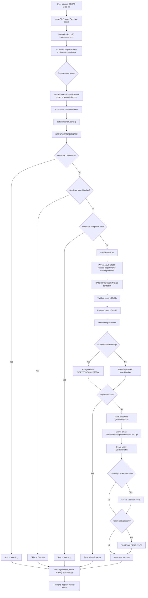

# Student Import Flow

```mermaid
flowchart TD
    A["User uploads CSSPS Excel file"] --> B["parseFile() reads Excel via XLSX"]
    B --> C["normalizeRecord() lowercases keys"]
    C --> D["normalizeCsspsRecord() applies column aliases"]
    D --> E{"Preview table shown"}
    E --> F["handleProcessCsspsUpload() maps to student objects"]
    F --> G["POST /users/students/batch"]
    G --> H["batchImportStudents()"]
    H --> I["DEDUPLICATION PHASE"]
    I --> I1{"Duplicate CassRefId?"}
    I1 -->|Yes| I2["Skip → Warning"]
    I1 -->|No| I3{"Duplicate indexNumber?"}
    I3 -->|Yes| I4["Skip → Warning"]
    I3 -->|No| I5{"Duplicate composite key?"}
    I5 -->|Yes| I6["Skip → Warning"]
    I5 -->|No| I7["Add to active list"]
    I2 --> Z
    I4 --> Z
    I6 --> Z
    I7 --> J["PARALLEL FETCH: classes, departments, existing indexes"]
    J --> K["BATCH PROCESSING (20 per batch)"]
    K --> K1["Validate required fields"]
    K1 --> K2["Resolve currentClassId"]
    K2 --> K3["Resolve departmentId"]
    K3 --> K4{"indexNumber missing?"}
    K4 -->|Yes| K5["Auto-generate: {DEPTCODE}{2025}{SEQ}"]
    K4 -->|No| K6["Sanitize provided indexNumber"]
    K5 --> K7{"Duplicate in DB?"}
    K6 --> K7
    K7 -->|Yes| K8["Error: already exists"]
    K7 -->|No| K9["Hash password (Student@123!)"]
    K9 --> K10["Derive email: {indexNumber}@st.mandoshts.edu.gh"]
    K10 --> K11["Create User + StudentProfile"]
    K11 --> K12{"Disability/CanReadBraille?"}
    K12 -->|Yes| K13["Create MedicalRecord"]
    K12 -->|No| K14
    K13 --> K14{"Parent data present?"}
    K14 -->|Yes| K15["Find/create Parent + Link"]
    K14 -->|No| K16["Increment success"]
    K15 --> K16
    K8 --> Z
    K16 --> Z
    Z["Return { success, failed, errors[], warnings[] }"]
    Z --> AA["Frontend displays results modal"]
```
